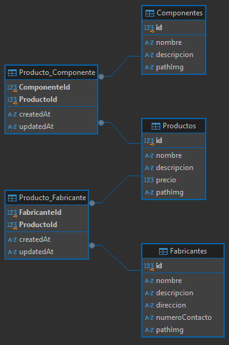

# Grupopersistencia - TP GRUPAL 1

Este proyecto implementa una API REST desarollada con Express.js y SQLite. Permite gestionar las operaciones CRUD sobre los recursos Producto, Fabricante y Componente, utilizando el ORM (Object-relational mapping) Sequelize.
Las funcionalidades desarrolladas en el proyecto permiten automatizar y gestionar de manera integrada los datos.

## Tecnologías utilizadas

- Node.js
- Express.js
- SQLite
- Nodemon

## Instalación y ejecución de la API

### Requisitos previos

- Node.js
- npm (Node Package Manager)

### Pasos para la instalación

Ejecuta los siguientes comandos para correr la API en la máquina local.

- Clonar el repositorio

  `git clone https://github.com/EP-2024C2/tp-ntom-grupopersistencia.git`

- Instalar dependecias dentro del directorio del proyecto

  `npm i`

- Inicializar el servidor

  `npm start`

- Para entornos de desarrollo (como nodemon) inicializar con el comando

  `npm run dev`

## Ejecución de la API con otro motor de base de datos

El proyecto esta configurado con SQLite por defecto, si se desea cambiar el motor de db configurar:

### ..

### Configurar variables de entorno

- Crear un archivo `.env` en la raíz del proyecto

- Copiar el contenido del archivo `.env.example` al archivo `.env`.

- Establecer los valores necesarios en el archivo `.env` según tu entorno.

## Modelo Relacional

El proyecto presenta el siguiente diagrama de entidad-relacion (DER).

